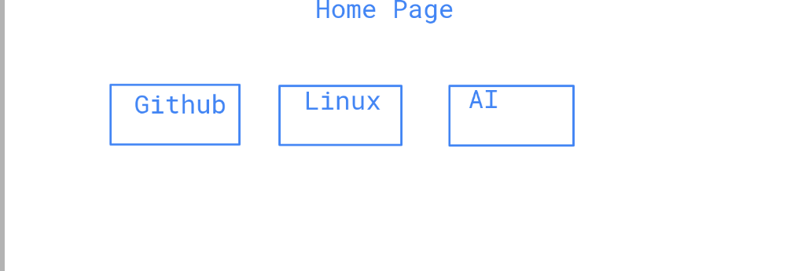

# Ariba Study Home

A modern, high-fidelity Single-Page Application (SPA) designed for interactive learning. Master Linux, Github, and AI through a professional, terminal-inspired educational interface.



## 🚀 Features

- **Single-Page Architecture**: Seamlessly switch between the hub and learning modules without page reloads.
- **Three-Pane Lesson Interface**: Sidebar navigation, rich lesson content, and interactive quiz panels.
- **Premium UI/UX**: Built with a clean light theme, custom circular icons, and smooth animations.
- **Gamified Learning**: Sequential module unlocking and integrated topic quizzes.
- **Progress Tracking**: Automatic tracking of completed modules.
- **Multi-Language Support**: Available in English, Bengali (বাংলা), and Arabic (العربية) with full RTL layout support.

## 📚 Documentation

- **[Feature Documentation](docs/Feature.md)** - Comprehensive feature overview and capabilities
- **[Arabic Language Support](docs/ARABIC_FEATURE.md)** - Details about RTL layout and Arabic translation
- **[Implementation Summary](docs/IMPLEMENTATION_SUMMARY.md)** - Technical implementation details and recent updates
- **[Docs README](docs/README.md)** - Documentation index and guidelines

## 📁 Project Structure

```text
├── index.html          # Global SPA Entry Point
├── assets/
│   ├── css/
│   │   └── style.css   # Modern UI Design System
│   ├── js/
│   │   └── app.js      # Core Logic & Content
│   └── images/         # Custom Circular Icons & Infographics
├── README.md           # Project Documentation
├── CONTRIBUTING.md     # Guidelines for Contributors
└── LICENSE             # MIT License
```

## 🛠️ Installation & Usage

1. **Clone the repository**:
   ```bash
   git clone https://github.com/boniyeamincse/ariba-study-home.git
   ```
2. **Open the project**:
   - Simply open `index.html` in any modern web browser.

## 🤝 Contributing

We welcome contributions! Please see our [CONTRIBUTING.md](CONTRIBUTING.md) for details on how to get started.

## 📜 License

This project is licensed under the MIT License - see the [LICENSE](LICENSE) file for details.

---
Developed with ❤️ by **Ariba Software Limited**.
